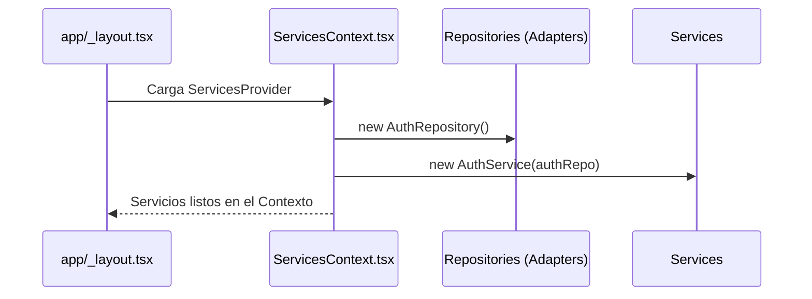
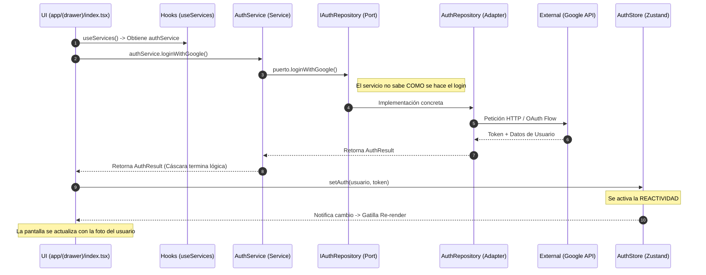

# Curso de Arquitectura Técnica: Skeleton App

Este documento es una guía profunda sobre cómo está construida esta aplicación, diseñada para desarrolladores que vienen de entornos de Backend o que desean entender los principios de ingeniería de software aplicados a una aplicación móvil/web moderna con Expo.

---

## 1. Filosofía de Diseño: Clean Architecture

La aplicación no se basa en "carpetas de componentes", sino en **Capas de Abstracción**. Seguimos una estructura de **Arquitectura Limpia (Ports & Adapters)**:

*   **Dominio (Modelos/Puertos)**: Las reglas de negocio y las interfaces. No depende de nadie.
*   **Aplicación (Servicios)**: Casos de uso que orquestan el negocio. No saben si los datos vienen de una API o una DB.
*   **Infraestructura (Repositorios/Adapters)**: Implementaciones concretas de los puertos (Google Auth, API REST, SQLite).
*   **UI/Presentación (React/Expo)**: La cáscara que el usuario toca. Consume servicios, nunca repositorios.

---

## 2. Fase 0: Carga de Código y Estado Inicial

Antes incluso de que la primera línea de `_layout.tsx` se ejecute, el motor de JavaScript carga los archivos.

### ¿Cuándo se inicializa el estado?
1.  **Carga de Módulos (Static Time)**: Cuando el motor lee `src/ui/stores/authStore.ts`, se crea la instancia de Zustand con sus valores por defecto (`user: null`). En este punto, la app aún no "existe" en pantalla.
2.  **Cableado de Dependencias**: Al cargar `src/context/ServicesContext.tsx`, se ejecutan los `new AuthRepository()` y `new AuthService()`. Esto ocurre una sola vez al arrancar la app.
3.  **Montaje (Runtime)**: React comienza a dibujar. El `ServicesProvider` toma esas instancias ya creadas y las mete en el "bus" (Contexto) para que estén disponibles.

---

## 3. Fase 1: El Arranque (Bootstrapping) y Resolución de Rutas

Cuando tecleas `http://localhost:8081/`, Expo Router tiene que decidir qué archivo mostrar.

### ¿Por qué `app/(drawer)/index.tsx`?
Expo Router sigue una convención de nombres de archivo (File-based routing):
1.  **Búsqueda del Root**: Al pedir `/`, busca un archivo llamado `index` en la carpeta `app/`.
2.  **Transparencia de Grupos**: Como explicamos en la sección 7, los folders con paréntesis `(drawer)` son **invisibles** para el sistema de rutas.
3.  **Resolución**: Para el enrutador, el archivo `app/(drawer)/index.tsx` es equivalente a `app/index.tsx`. Al ser el único "index" disponible en el nivel raíz (una vez ignorados los paréntesis), se convierte en la página de inicio por defecto.

---

## 4. Fase 2: Composición e Inyección (Composition Root)

Antes de que se dibuje nada en pantalla, ocurre la "Inyección de dependencias" en `src/context/ServicesContext.tsx`:



---

## 5. Fase 3: Construcción de la UI (Layouts y Navegación)

Una vez los servicios están listos, la aplicación decide qué "cascara" mostrar.

1.  **Layouts Jerárquicos**: Expo Router usa archivos `_layout.tsx` para definir la estructura visual.
    *   `app/_layout.tsx`: Define el root (Gestos, Providers).
    *   `app/(drawer)/_layout.tsx`: Define que la navegación principal será un menú lateral (Drawer).
2.  **Descubrimiento de Servicios**: Cuando una página o componente (ej. `app/(drawer)/index.tsx`) se monta, usa un **Hook** para "engancharse" al contexto global:
    ```tsx
    const { authService } = useServices();
    ```

---

## 6. Fase 4: Gestión de Estado y Reactividad (Zustand)

Aquí es donde el backend y el frontend difieren más. En el backend, una petición termina y el estado se pierde. En el frontend, la aplicación es un **proceso de larga duración**.

### El Patrón Observer
Usamos **Zustand** (`src/ui/stores/`) como nuestra "Base de Datos en Memoria". 
*   **No es solo una variable global**: Es un objeto que implementa el patrón **Observer**.
*   Cuando un dato en el Store cambia (ej. el usuario logueado), el Store **notifica** proactivamente a todos los componentes que están "escuchando" ese dato específico.

### Reactividad: El Loop de Renderizado
1.  **Subscripción**: El componente en `app/(drawer)/index.tsx` llama a `useAuthStore()`. Esto lo suscribe a cambios.
2.  **Notificación**: Un servicio actualiza el store.
3.  **Re-ejecución**: React detecta el cambio y vuelve a ejecutar la función del componente de la página principal.
4.  **Diferenciación (Diffing)**: React compara el nuevo XML vs el anterior y solo actualiza los píxeles necesarios en pantalla.

---

## 7. Fase 5: Ciclo de Vida de una Acción (Request Flow)

Veamos el flujo detallado de lo que ocurre cuando el usuario hace clic en "Login con Google" dentro de `app/(drawer)/index.tsx`:



### Conceptos Clave en el Flujo:
*   **Asincronía**: Los pasos 4 al 8 son asíncronos (`async/await`). La UI no se bloquea; suele mostrar un estado de `loading`.
*   **Inversión de Control**: El Servicio (Paso 3) depende de una Interfaz (Puerto), lo que permite que en los tests unitarios podamos sustituir el Repositorio Real por un "Mock" sin que el Servicio se entere.

---

---

## 8. Concepto Avanzado: Grupos de Rutas `(drawer)`

Es probable que te hayas fijado en que hay carpetas con paréntesis, como `app/(drawer)/`.

### ¿Por qué los paréntesis?
En **Expo Router**, poner un nombre entre paréntesis crea un **Route Group**. Su función es puramente organizativa y de Layout, sin afectar a la URL:
*   **Invisible en la URL**: Una ruta dentro de `app/(drawer)/index.tsx` se accede como `/`, no como `/(drawer)/`.
*   **Layout Compartido**: Todos los archivos dentro de `(drawer)` comparten el mismo `_layout.tsx`. En este caso, ese layout define que todas esas páginas tendrán un menú lateral (Drawer).

**Analogía Backend**: Imagina que tienes un grupo de controladores que deben compartir un mismo `Middleware` o `Interceptor` de seguridad. En lugar de anotarlos uno a uno, los metes en un folder "lógico" que aplica esa configuración a todos.

---

## 9. Organización de Archivos (La Razón de Ser)

Para navegar el código, piensa en la responsabilidad de cada carpeta:

| Directorio | Responsabilidad | ¿Por qué existe? |
|---|---|---|
| `app/` | Rutas y Controladores de Vista | Maneja la URL o la navegación física. |
| `src/context/` | Pegamento y DI | Donde el código se une para formar la app. |
| `src/services/` | Lógica de Negocio | Donde viven las reglas (ej: "Solo deja entrar si el email es corporativo"). |
| `src/model/ports/` | Contratos | Define CÓMO deben ser los repositorios. |
| `src/repositories/` | I/O e Implementación | Donde vive el código que "habla" con el exterior. |
| `src/ui/stores/` | Estado de Aplicación | La caché de datos que sobrevive al cambio de pantallas. |
| `src/ui/theme/` | Diseño | La fuente de verdad visual (colores, fuentes). |

---

---

## 10. Mejores Prácticas del Proyecto

1.  **Stateless Services**: Los servicios no deben guardar datos en variables internas. Deben ser funciones puras o depender de Stores externos.
2.  **Isolation**: Nunca importes algo de `src/repositories/` dentro de un componente de UI o un Servicio. Siempre usa el Contexto.
3.  **UI como Proyección**: Diseña tus pantallas pensando: "¿Qué datos del Store necesito para dibujar esto?". Si los datos cambian, la UI se arreglará sola.

---

Este esqueleto te permitirá construir aplicaciones complejas manteniendo el orden de un sistema empresarial robusto pero con la agilidad y reactividad de una app moderna.
